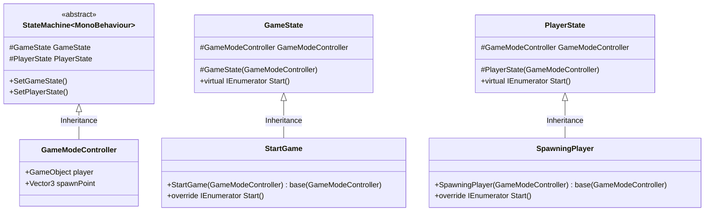
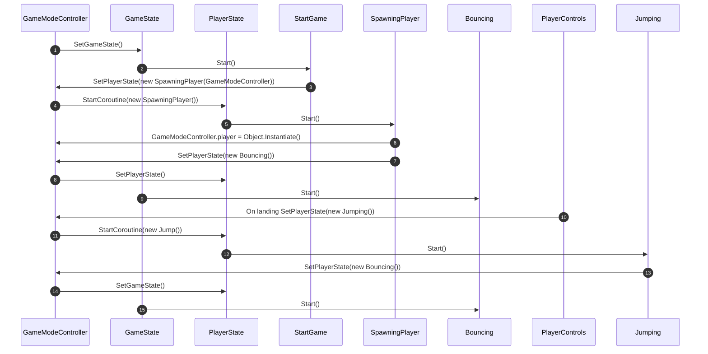

<h1>Document List</h1>

[**Project Description** *(README.md)*](README.md#bounce-climber-project-description)

[**Game Manual** *(GAMEMANUAL.md)*](GAMEMANUAL.md#game-manual)

[**To-do List** *(TODOLIST.md)*](TODOLIST.md#to-do-list)

[**Project Plans** *(PROJECTPLANS.md)*](PROJECTPLANS.md#project-plans)

# Project Plans

## Project diagram using Mermaid Diagrams

My project script structure

