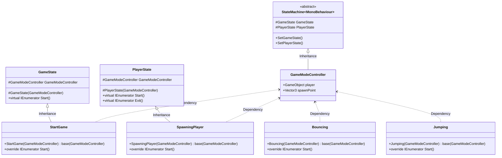
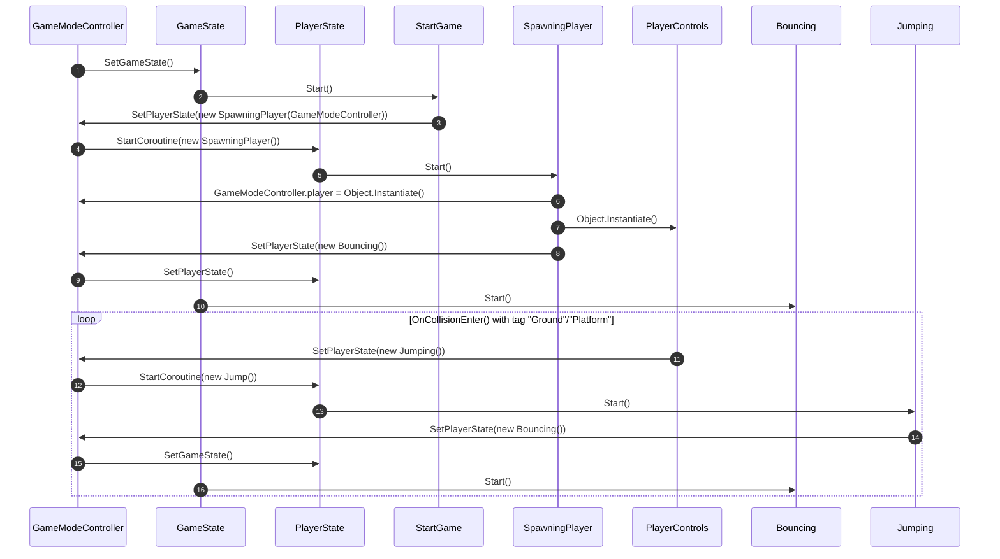

<h1>Document List</h1>

[**Project Description** *(README.md)*](README.md#bounce-climber-project-description)

[**Game Manual** *(GAMEMANUAL.md)*](GAMEMANUAL.md#game-manual)

[**To-do List** *(TODOLIST.md)*](TODOLIST.md#to-do-list)

[**Project Plans** *(PROJECTPLANS.md)*](PROJECTPLANS.md#project-plans)

# Project Plans

## Project diagram using Mermaid Diagrams

- ### Class Diagram

    - Diagram where it's showing structure and dependancies of classes.

- ### Sequence Diagram

    - Diagram where it's showing interactions between classes, it goes from starting the game to spawning ball and at the end showing loop how the ball behaves.

