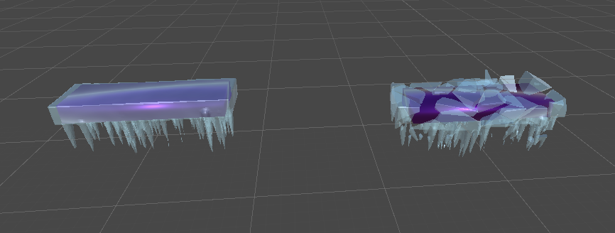

# Bounce Climber Project Description

My first large scale project using Unity and Blender!

My goal with the project is to learn game developement with unity. As I started creating the game I realized that creating objects in unity might not be what I want to go for, instead learn to make objects in blender.
I picked up blender and found tutorials that really sparked my interest in it, how "easy" it is to create very realistic looking objects. So now I have been sticking to Unity and Blender.

I aim to be able to do the basics needed to create a game from scratch on unity using blender and image manipulation software, like GIMP. Bonus to my goal is to create my game using very good design in all of the aspects I use.
I am heavily enjoying OOP and the way I can use it in unity. I am starting to get the hang of blender slowly, using geometry nodes and shaders is a ton of fun.
As of writing this now 4th of May, I still have lot to learn, but I am looking forward to finishing this project and be proud of it!

# To-do-list

## Game Structure

- [ ] Using state machines
    - [ ] Have a state for the player to be able to showcase the ball in menus

## Game Mechanics

- [ ] Game menus
    - [ ] Main Menu
    - [ ] Settings menu
        - [ ] Game Settings
            - [ ] Ball color change
        - [ ] Sound Settings
            - [ ] Change volume for sounds

- [ ] Close game loop (Start game --> play --> lose/win --> start game)

- [ ] Make a "charge-up jump" when holding down "down-key" (S or Arrow down)

- [ ] Add double-jump for the ball

- [ ] Cycle of Seasons with distance

- [x] Make icy platform break effect (ice break animation and only platform inside is left)

## Art
- [ ] Polishing game with graphics and sounds
    - [ ] Ball deformation
    - [ ] Better splash animation on landing
    - [ ] Better default platform break animation
- [ ] Add more platform types
    - [x] Winter
        - [x] Winter platform animations
    - [ ] Spring
    - [x] Summer
        - [ ] Summer platform animations
    - [ ] Autumn

## Screenshots and GIFs

