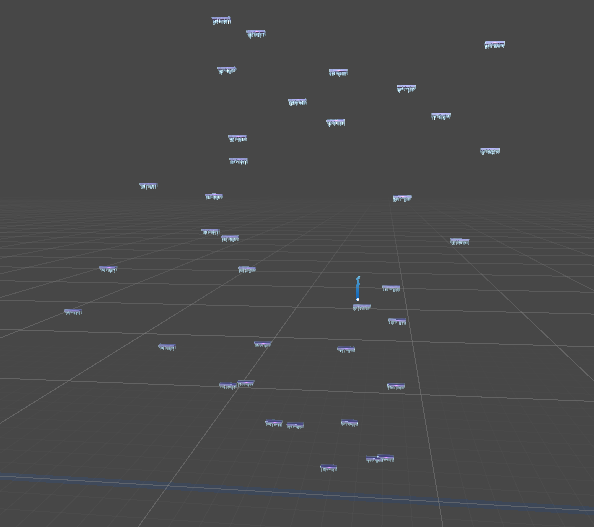

# Bounce Climber Project Description

My first and biggest project using Unity and Blender!

My goal with the project is to learn game developement with unity. As I started creating the game I realized that creating objects in unity might not be what I want to go for, instead learn to make objects in blender.

I picked up blender and found tutorials that really sparked my interest in it, how "easy" it is to create very realistic looking objects. So now I have been sticking to Unity and Blender.

I aim to be able to do the basics needed to create a game from scratch on unity using blender and image manipulation software, like GIMP. Bonus to my goal is to create my game using very good design in all of the aspects I use.

I am heavily enjoying OOP and the way I can use it in unity. I am starting to get the hang of blender slowly, using geometry nodes and shaders is a ton of fun.

As of writing this now 4th of May, I still have lot to learn, but I am looking forward to finishing this project and be proud of it!

# To-do list

## Game Structure

I will gather here things that are mostly done in the side of creating a skeleton for the game to work with.

- [ ] State machines
    - [ ] **Player**
        - [ ] Basic States
            - [ ] Playing
            - [ ] In Main Menu
            - [ ] Movement
                - [ ] Bouncing
                - [ ] Falling
                - [ ] Jumping

        - [ ] Special States
            - [ ] Static Toggle
            - [ ] Collision Toggle
            - [ ] Showcase for menus
                - [ ] Idle
                - [ ] Bouncing

    - [ ] **Game**
        - [ ] Main Menu
        - [ ] Paused
        - [ ] Playing

- [ ] **Platform changes**
    - [x] Give platforms breakable layers
        - [ ] As a list
        - [ ] Have set their own health

- [ ] **Player changes**
    - [ ] Inflict damage to platforms on contact
        - [ ] Static amount
            - [ ] Eventually upgradeable (lower damage inflicted)
        - [ ] Based on speed on contact

## Game Mechanics

Here I am aiming to use the skeleton of the game

### Game menus

- [ ] **Main Menu**
    - [ ] Play Game Menu
        - [ ] Start Game
        - [ ] Change Gamemode
        - [ ] Back to Main Menu
- [ ] **Pause Menu**
    - [ ] Continue
    - [ ] Settings Menu
    - [ ] To Main Menu

- [ ] **Gameover Menu**
    - [ ] Restart
    - [ ] To Main Menu

- [ ] **Settings Menu**
    - [ ] Game Settings
        - [ ] Ball color change

    - [ ] Sound Settings
        - [ ] Main Volume Slider 0 to 100 (Default 50)

### Minimap

- [ ] Intuitive to read
- [ ] Useful for micro-movements

### Gameplay

#### Player Specific

- [ ] [**Charge jump ability**](#charge-jump-ability)
- [ ] [**Dash ability**](#dash-ability)
- [ ] [**Dive ability**](#dive-ability)

- [ ] Player/Ball deformation
    - [ ] On bounce
    - [ ] On high speeds
    - [ ] Back to original on zero speed
    - [ ] Jump delay based on Falling speed
    - [ ] Deformation amount based on falling speed
    - [ ] Add extra special effects on higher velocities

- [ ] Double-jump
- [x] Icy platform break on contact (from above)

#### Game Specific

- [ ] Give platforms "health" for when they break
    - [ ] Some platforms to never break
    - [ ] Some platforms to have layers, which have their own health
- [ ] Close game loop (Start game --> play --> lose/win --> start game)
- [ ] Cycle of Seasons with distance

## Art

I aim to create very pleasing looking and sounding game with these effects

- [ ] Polishing game with graphics and sounds
    - [ ] Ball deformation
    - [ ] Better splash animation on landing
    - [ ] Better default platform break animation

- [ ] Add more platform types
    - [x] **Winter**
        - [x] Winter platform animations (Ice break and melt)
        - [ ] Unique sound on ice and the platform
        - [x] Unique animation on land (Ice breaking, none for platform inside)

    - [ ] **Spring**

    - [x] **Summer**
        - [ ] Summer platform animations (maybe flowers growing, bees flying)
        - [ ] Unique sound
        - [ ] Unique animation on land

    - [ ] **Autumn**

#### Ball has a trail and creates dust or wind on contact with a platform

# Game Manual

## GameModes

### No Breaks

#### Explanation
In this gamemode you aim to climb upwards while staying in the camera view. Camera keeps accelerating up faster. If you fall behind of the camera/out of view you will lose life/die.

#### Still images

## Objects

### Player

#### Ball

##### Still images

### Platforms

#### Animation for default platform break

#### Ice Platform

##### Still image

##### Animations

#### Grass Platform

##### Still image

##### Animations

No GIF.

## Player Mechanics

### Behavior

#### Bouncing
By default player will be always bouncing with a set velocity, to change bounce height player is given vertical movement, but instead of bounce velocity it introduces gravity changes. This way player can levitate a bit or fall down faster.

### Controls

### Abilities

#### Dash ability

Player can dash to a direction by double-tapping left or right (or alternatively tapping shift + directional key). It will reset falling speed on use, and will dash a set distance to left and right and reset horizontal movement at the end of dash. By reset I mean setting it to zero (or maybe some other value in the future).

#### Dive ability

Player is able to dive with great speed downwards to hit into a platform faster than just plainly falling. It is activated by pressing Down-key

#### Charge Jump ability

Player is able to reach greater heights using Charge Jump. It's used by holding down Down-key whlist you are ontop of a surface. It will pause [**Bouncing**](#bouncing) during, and the longer you hold the higher you can jump.